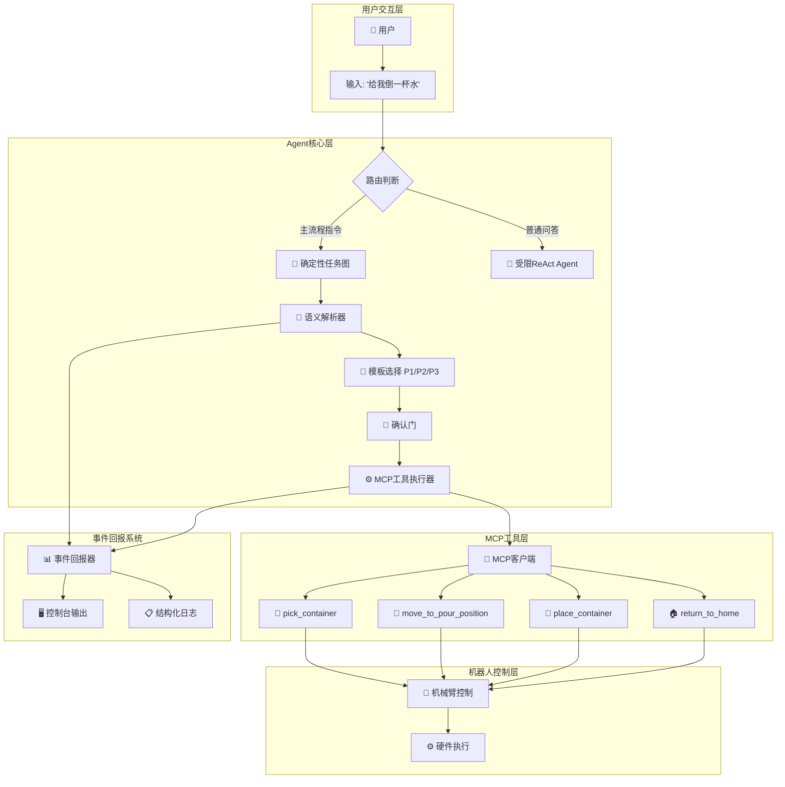

# Agent框架设计图

## 整体架构流程图



## 详细处理流程："给我倒一杯水"

### 第一阶段：输入路由与解析

```
┌─────────────────────────────────────────────────────────────────┐
│ 1. 用户输入处理                                                 │
├─────────────────────────────────────────────────────────────────┤
│ 输入: "给我倒一杯水"                                            │
│ ↓                                                               │
│ 路由判断: 包含"倒"关键词 → 进入任务图模式                      │
│ ↓                                                               │
│ 调用: run_main_sequence_cli(tools, "给我倒一杯水", reporter)    │
└─────────────────────────────────────────────────────────────────┘
```

### 第二阶段：语义解析与模板选择

```
┌─────────────────────────────────────────────────────────────────┐
│ 2. resolve_and_choose_plan 解析阶段                             │
├─────────────────────────────────────────────────────────────────┤
│ 正则提取:                                                       │
│   - object_ids = [] (未明确指定对象)                            │
│   - dst目标 = None (未指定"给谁"或"dst:")                       │
│   - no_pour = False (不含"不倒水"关键词)                        │
│ ↓                                                               │
│ 模板选择逻辑:                                                   │
│   - no_pour=False, dst=None → 选择模板P2                        │
│   - do_pour=True (允许倾倒)                                     │
│ ↓                                                               │
│ 状态设置:                                                       │
│   - object_id: None (将使用默认对象)                            │
│   - target_object_id: None (默认倾倒位置)                       │
│   - do_pour: True                                               │
│   - plan_template: "P2"                                         │
│ ↓                                                               │
│ 事件上报: "模板=P2 源=未指定 目标=默认 倾倒=是"                 │
└─────────────────────────────────────────────────────────────────┘
```

### 第三阶段：确定性任务图执行

```
┌─────────────────────────────────────────────────────────────────┐
│ 3. 任务图状态机执行 (pick → move_to_pour → place → return)      │
├─────────────────────────────────────────────────────────────────┤
│                                                                 │
│ ┌─────────────┐    ┌─────────────┐    ┌─────────────┐           │
│ │confirm_pick │ -> │   do_pick   │ -> │confirm_move │ -> ...    │
│ │             │    │             │    │  _to_pour   │           │
│ └─────────────┘    └─────────────┘    └─────────────┘           │
│        │                  │                  │                  │
│        ▼                  ▼                  ▼                  │
│   [确认门]           [MCP工具调用]       [确认门]               │
│                                                                 │
└─────────────────────────────────────────────────────────────────┘
```

### 第四阶段：MCP工具调用详情

```
步骤1: PICK阶段
┌─────────────────────────────────────────────────────────────────┐
│ confirm_pick:                                                   │
│   提示: "确认开始抓取容器 (pick) 源ID=未指定?" → 用户输入yes      │
│ ↓                                                               │
│ do_pick:                                                        │
│   工具: mcp_MTC_SERVER_pick_container                           │
│   参数: {} (使用默认对象)                                       │
│   事件: before_tool | step=pick | tool=mcp_MTC_SERVER_pick...  │
│   执行: await tool.ainvoke({})                                  │
│   结果: {ok: true, status: "success", duration_sec: 3.2}       │
│   事件: after_tool | step=pick | success=True                  │
└─────────────────────────────────────────────────────────────────┘

步骤2: MOVE_TO_POUR阶段  
┌─────────────────────────────────────────────────────────────────┐
│ confirm_move_to_pour:                                           │
│   提示: "确认移动到倾倒位置，目标=默认，执行倾倒=是?" → yes       │
│ ↓                                                               │
│ do_move_to_pour:                                                │
│   工具: mcp_MTC_SERVER_move_to_pour_position                    │
│   参数: {pour_execute: true} (P2模板，允许倾倒)                 │
│   事件: before_tool | step=move_to_pour | params={pour_exe...} │
│   执行: await tool.ainvoke({pour_execute: true})                │
│   结果: {ok: true, status: "poured_successfully"}              │
│   事件: after_tool | step=move_to_pour | success=True          │
└─────────────────────────────────────────────────────────────────┘

步骤3: PLACE阶段
┌─────────────────────────────────────────────────────────────────┐
│ confirm_place:                                                  │
│   提示: "确认放置容器至其原始位置?" → yes                        │
│ ↓                                                               │
│ do_place:                                                       │
│   工具: mcp_MTC_SERVER_place_container                          │
│   参数: {return_to_origin: true}                                │
│   执行: 将容器放回原位                                          │
│   结果: {ok: true, status: "placed_successfully"}              │
└─────────────────────────────────────────────────────────────────┘

步骤4: RETURN阶段
┌─────────────────────────────────────────────────────────────────┐
│ confirm_return:                                                 │
│   提示: "确认回到安全位置?" → yes                                │
│ ↓                                                               │
│ do_return:                                                      │
│   工具: mcp_MTC_SERVER_return_to_home                           │
│   参数: {} (使用默认home配置)                                   │
│   执行: 机械臂回到安全位置                                      │
│   结果: {ok: true, status: "returned_home"}                    │
└─────────────────────────────────────────────────────────────────┘
```

### 第五阶段：结果汇总与输出

```
┌─────────────────────────────────────────────────────────────────┐
│ 5. 最终结果汇总                                                 │
├─────────────────────────────────────────────────────────────────┤
│ 执行总结:                                                       │
│ {                                                               │
│   "template": "P2",                                             │
│   "do_pour": true,                                              │
│   "source": null,                                               │
│   "target": null,                                               │
│   "success": true,                                              │
│   "results": {                                                  │
│     "pick": {success: true, duration_sec: 3.2},                │
│     "move_to_pour": {success: true, duration_sec: 8.5},        │
│     "place": {success: true, duration_sec: 2.1},               │
│     "return": {success: true, duration_sec: 1.8}               │
│   },                                                            │
│   "events": [...]                                               │
│ }                                                               │
│ ↓                                                               │
│ 控制台输出: "🤖 Agent: 任务完成！已为您倒水并归位"              │
└─────────────────────────────────────────────────────────────────┘
```

## 关键设计特点

### 1. 安全边界
```
┌─────────────┐    ┌─────────────┐    ┌─────────────┐
│    LLM      │    │     MCP     │    │   机器人    │
│  语义解析    │    │   工具层    │    │   硬件层    │
├─────────────┤    ├─────────────┤    ├─────────────┤
│✅ 解析意图   │    │✅ 运动控制   │    │✅ 执行动作   │
│✅ 选择模板   │    │✅ 参数模板   │    │✅ 传感反馈   │
│✅ 事件解释   │    │✅ 安全检查   │    │✅ 状态上报   │
│❌ 生成坐标   │    │❌ 语义理解   │    │❌ 决策推理   │
│❌ 直接控制   │    │❌ 自然语言   │    │❌ 意图解析   │
└─────────────┘    └─────────────┘    └─────────────┘
```

### 2. 确认门机制
```
每个高风险步骤前都有人工确认：
┌─────────┐    ┌─────────┐    ┌─────────┐    ┌─────────┐
│ 确认抓取 │ -> │ 确认倾倒 │ -> │ 确认放置 │ -> │ 确认归位 │
└─────────┘    └─────────┘    └─────────┘    └─────────┘
     ↓              ↓              ↓              ↓
  [yes/no]      [yes/no]      [yes/no]      [yes/no]
```

### 3. 事件回报系统
```
┌─────────────┐    ┌─────────────┐    ┌─────────────┐
│ plan_selected│ -> │ before_tool │ -> │ after_tool  │
│   模板选择   │    │  调用前参数  │    │  执行结果   │
└─────────────┘    └─────────────┘    └─────────────┘
                            │
                            ▼
                   ┌─────────────┐
                   │fallback_xxx │
                   │  回退机制   │  
                   └─────────────┘
```

这个设计确保了：
- **可控性**: 确定性任务图 + 人工确认门
- **安全性**: LLM不直接生成运动参数  
- **可观测性**: 结构化事件回报
- **鲁棒性**: 失败回退机制
- **可审计性**: 完整的执行日志 