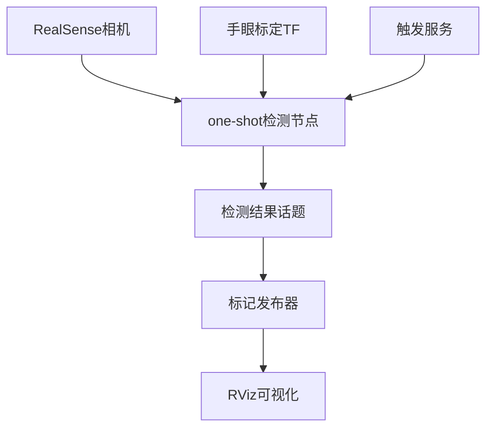

# One-Shot 物体检测系统使用指南

这是一个基于YOLO的one-shot物体检测系统，能够从相机话题获取单帧数据进行检测，并通过手眼标定矩阵将物体坐标转换到机器人基座坐标系。

## 功能特性

- **One-shot检测**: 通过服务调用触发单次检测，避免连续检测的资源消耗
- **3D位置计算**: 结合RGB-D数据计算物体的3D位置和尺寸
- **坐标转换**: 自动通过TF获取手眼标定矩阵，将相机坐标转换为基座坐标
- **RViz可视化**: 在RViz中显示检测到的物体位置和信息
- **多类别检测**: 支持检测人、杯子、瓶子、碗等多种物体

## 系统架构



## 安装和编译

### 1. 安装依赖

```bash
# 安装YOLO
pip install ultralytics

# 安装OpenCV (如果没有)
pip install opencv-python

# 确保RealSense相机驱动已安装
sudo apt install ros-humble-realsense2-camera
```

### 2. 编译

```bash
cd ~/uf_custom_ws
colcon build --packages-select mtc_interface mtc_tutorial
source install/setup.bash
```

## 使用方法

### 1. 启动完整系统

```bash
# 启动相机、手眼标定和检测节点
ros2 launch mtc_tutorial oneshot_object_detection.launch.py
```

### 2. 分步启动（调试用）

```bash
# 1. 启动相机
ros2 launch realsense2_camera rs_launch.py align_depth.enable:=true

# 2. 启动手眼标定TF发布器
ros2 launch charuco_handeye_publish.launch.py

# 3. 启动检测节点
ros2 run mtc_tutorial oneshot_object_detection.py

# 4. 启动标记发布器
ros2 run mtc_tutorial object_marker_publisher.py

# 5. 启动RViz
ros2 run rviz2 rviz2
```

### 3. 触发检测

```bash
# 调用服务触发一次检测
ros2 service call /trigger_object_detection std_srvs/srv/Trigger
```

### 4. 查看结果

检测结果会通过以下方式输出：

1. **终端日志**: 详细的检测信息会打印到终端
2. **OpenCV窗口**: 显示带有检测框和标注的图像
3. **RViz标记**: 在RViz中显示3D物体位置和信息
4. **ROS话题**: 结构化数据发布到 `/object_detection_result`

## 配置参数

### 启动参数

| 参数 | 默认值 | 说明 |
|------|--------|------|
| `launch_camera` | true | 是否启动RealSense相机 |
| `launch_handeye_tf` | true | 是否启动手眼标定TF |
| `calibration_name` | charuco_eye_to_hand_1 | 手眼标定名称 |
| `yolo_model` | yolov8s.pt | YOLO模型文件 |
| `confidence_threshold` | 0.5 | 检测置信度阈值 |
| `camera_frame` | camera_color_optical_frame | 相机坐标系 |
| `base_frame` | link_base | 基座坐标系 |

### 自定义启动

```bash
# 使用自定义参数启动
ros2 launch mtc_tutorial oneshot_object_detection.launch.py \
  yolo_model:=yolov8n.pt \
  confidence_threshold:=0.6 \
  base_frame:=base_link
```

## 话题和服务

### 输入话题

- `/camera/camera/color/image_raw` - 彩色图像
- `/camera/camera/aligned_depth_to_color/image_raw` - 对齐的深度图像
- `/camera/camera/color/camera_info` - 相机内参

### 输出话题

- `/object_detection_result` - 检测结果 (mtc_interface/DetectionResult)
- `/object_markers` - RViz标记 (visualization_msgs/MarkerArray)

### 服务

- `/trigger_object_detection` - 触发检测 (std_srvs/Trigger)

## 检测结果格式

检测结果包含以下信息：

```yaml
DetectionResult:
  header: 
    stamp: 时间戳
    frame_id: 相机坐标系
  camera_fx/fy/cx/cy: 相机内参
  camera_frame: 相机坐标系名称
  base_frame: 基座坐标系名称
  transform_available: 手眼转换是否可用
  objects:
    - class_name: "cup"
      confidence: 0.85
      bbox_x1/y1/x2/y2: 2D边界框
      position_camera: 相机坐标系3D位置
      position_base: 基座坐标系3D位置
      size_3d: 3D尺寸
      volume_3d: 体积
      transform_valid: 坐标转换是否成功
  total_objects: 检测到的物体数量
  processing_time: 处理时间
```

## RViz配置

在RViz中添加以下显示项来查看检测结果：

1. **MarkerArray** - 订阅 `/object_markers` 话题
2. **TF** - 显示坐标系变换
3. **Image** - 显示相机图像（可选）

### 建议的RViz显示设置

- Fixed Frame: `link_base` 或 `camera_color_optical_frame`
- MarkerArray:
  - Topic: `/object_markers`
  - 可以分别显示位置点、边界框和标签

## 故障排除

### 常见问题

1. **YOLO模型加载失败**
   ```bash
   # 检查YOLO是否正确安装
   python -c "from ultralytics import YOLO; print('YOLO available')"
   ```

2. **相机数据不可用**
   ```bash
   # 检查相机话题
   ros2 topic list | grep camera
   ros2 topic hz /camera/camera/color/image_raw
   ```

3. **手眼转换不可用**
   ```bash
   # 检查TF变换
   ros2 run tf2_tools view_frames
   ros2 run tf2_ros tf2_echo link_base camera_color_optical_frame
   ```

4. **CV Bridge错误**
   ```bash
   # 安装cv_bridge
   sudo apt install ros-humble-cv-bridge
   ```

### 调试命令

```bash
# 检查节点状态
ros2 node list
ros2 node info /oneshot_object_detection

# 检查话题
ros2 topic list
ros2 topic echo /object_detection_result

# 检查服务
ros2 service list
ros2 service type /trigger_object_detection

# 检查参数
ros2 param list /oneshot_object_detection
ros2 param get /oneshot_object_detection camera_frame
```

## 性能优化

1. **模型选择**: 
   - `yolov8n.pt` - 最快，精度较低
   - `yolov8s.pt` - 平衡 (推荐)
   - `yolov8m.pt` - 较慢，精度较高

2. **置信度阈值**: 提高阈值可减少误检，但可能遗漏真实物体

3. **图像分辨率**: 相机分辨率影响检测精度和处理速度

## 扩展功能

### 添加新的物体类别

修改启动参数中的 `allowed_classes`：

```bash
ros2 launch mtc_tutorial oneshot_object_detection.launch.py \
  allowed_classes:="['person', 'cup', 'bottle', 'bowl', 'apple', 'banana']"
```

### 自定义YOLO模型

```bash
# 使用自定义训练的模型
ros2 launch mtc_tutorial oneshot_object_detection.launch.py \
  yolo_model:=/path/to/custom_model.pt
```

## 与机器人控制集成

检测结果可以直接用于机器人路径规划：

```python
# 示例：获取检测到的杯子位置用于抓取
import rclpy
from mtc_interface.msg import DetectionResult

def detection_callback(msg):
    for obj in msg.objects:
        if obj.class_name == 'cup' and obj.transform_valid:
            cup_position = obj.position_base
            print(f"Cup at: {cup_position.x:.3f}, {cup_position.y:.3f}, {cup_position.z:.3f}")
            # 可以直接用于MTC任务规划
```

## 注意事项

1. **坐标系对齐**: 确保手眼标定准确，否则基座坐标系转换会有误差
2. **深度数据质量**: 物体表面的反射特性会影响深度测量精度
3. **光照条件**: YOLO检测性能受光照条件影响
4. **物体遮挡**: 被遮挡的物体可能无法准确检测

## 更新日志

- v1.0: 初始版本，支持基本的one-shot检测和坐标转换
- v1.1: 添加RViz可视化和多种物体类别支持
- v1.2: 改进了坐标转换的鲁棒性和错误处理 